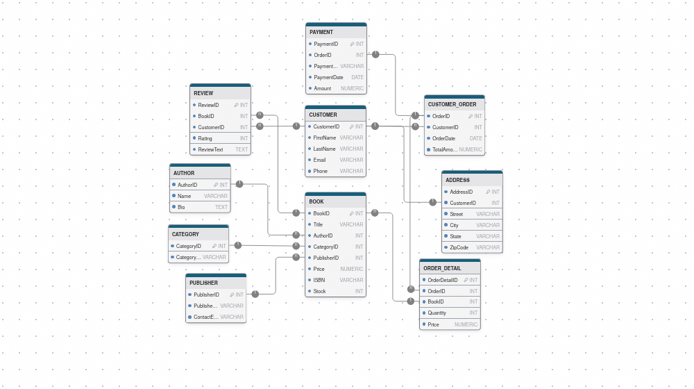
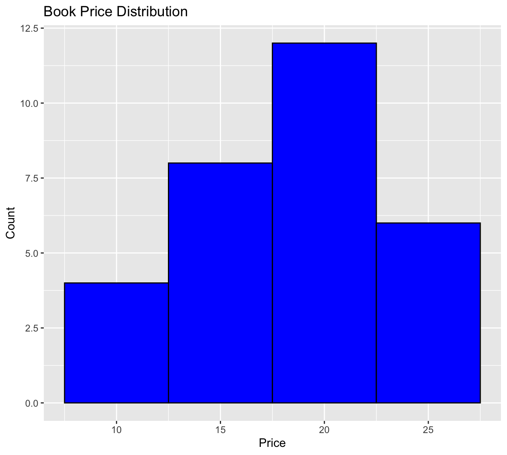
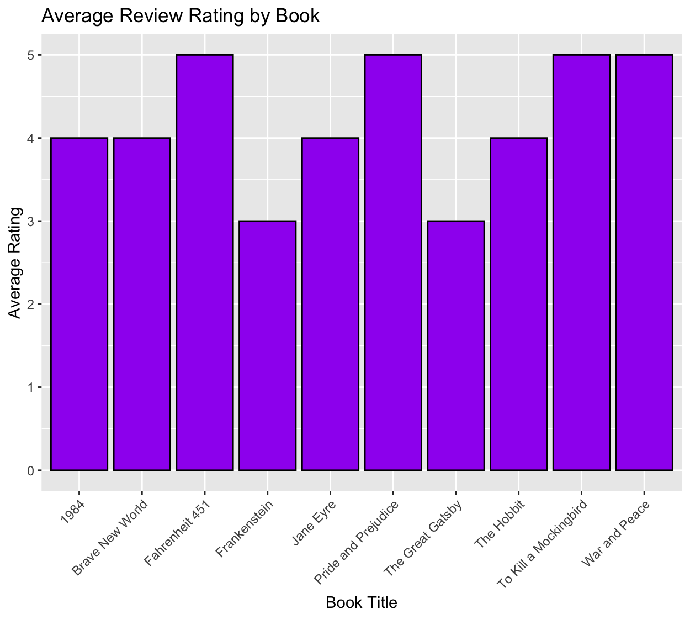
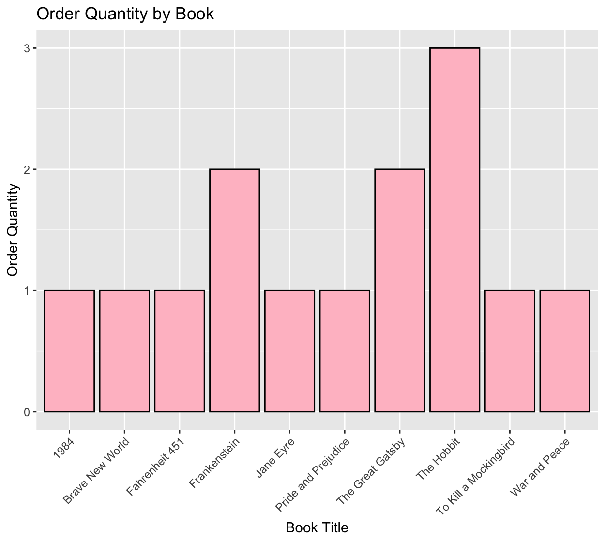
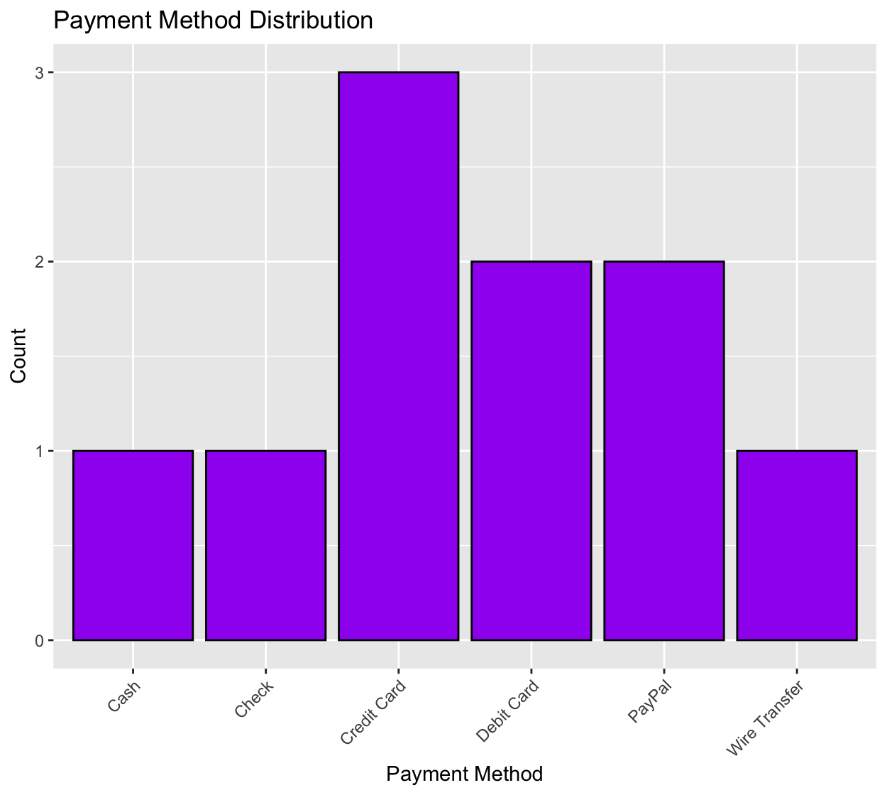
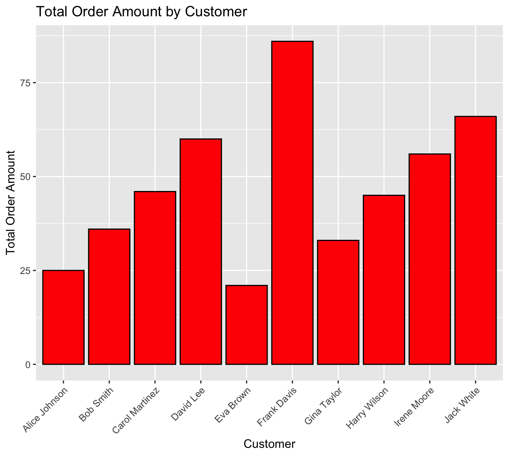

# Big Data & Analytics DBDS+SE Final Project

## Project Description

This project was prepared for the end-of-year final assignment. As our topic is a Book Store, we discussed and planned about our needs with the team. A model was created to represent our Book Store's operations and created a roadmap.

An ER diagram was used to define explicitly the assets and relationships, correcting errors on the way. After the team had reached consensus, we built the database using SQL, adding the proper constraints.

We normalized the database from 1NF to 5NF using normalization techniques that reduced data redundancy and inconsistencies.

## Technologies Used

This project utilizes various technologies:

- **MySQL**: Database management.
- **DrawDB**: ER Diagram
- **R**: Utilized for generating visual data representations.
- **Random Addresses Generator**: [TestingBot Random Address Generator](https://testingbot.com/free-online-tools/random-address-generator) used for generating sample addresses for testing.

## Team Members

- **Ömer Duran** 
- **Mikhail Serga**
- **Danylo Bazalinskyi**
- **Taha Buğra Tağ**
- **A. (G.) V.**

## ER Diagram



# Data Visualizations

## Histogram showing the price distribution of books
```R
ggplot(BOOK, aes(x = Price)) +
  geom_histogram(binwidth = 5, fill = "blue", color = "black") +
  labs(title = "Book Price Distribution",
       x = "Price",
       y = "Count")
```



## Bar graph showing the average review score by book
```R
avg_rating_by_book <- aggregate(Rating ~ BookID, data = REVIEW, mean)
avg_rating_by_book <- merge(avg_rating_by_book, BOOK, by.x = "BookID", by.y = "BookID")

ggplot(avg_rating_by_book, aes(x = Title, y = Rating)) +
  geom_bar(stat = "identity", fill = "purple", color = "black") +
  labs(title = "Average Review Rating by Book",
       x = "Book Title",
       y = "Average Rating") +
  theme(axis.text.x = element_text(angle = 45, hjust = 1))
```



## Bar graph showing the order quantities of books
```R
order_quantity_by_book <- aggregate(Quantity ~ BookID, data = ORDER_DETAIL, sum)
order_quantity_by_book <- merge(order_quantity_by_book, BOOK, by.x = "BookID", by.y = "BookID")

ggplot(order_quantity_by_book, aes(x = Title, y = Quantity)) +
  geom_bar(stat = "identity", fill = "pink", color = "black") +
  labs(title = "Order Quantity by Book",
       x = "Book Title",
       y = "Order Quantity") +
  theme(axis.text.x = element_text(angle = 45, hjust = 1))
```



## Bar graph showing the distribution of payment methods
```R
payment_method_counts <- as.data.frame(table(PAYMENT$PaymentMethod))
colnames(payment_method_counts) <- c("PaymentMethod", "Count")

ggplot(payment_method_counts, aes(x = PaymentMethod, y = Count)) +
  geom_bar(stat = "identity", fill = "purple", color = "black") +
  labs(title = "Payment Method Distribution",
       x = "Payment Method",
       y = "Count") +
  theme(axis.text.x = element_text(angle = 45, hjust = 1))
```



## Bar graph showing total order amounts of customers
```R
total_order_amount_by_customer <- aggregate(TotalAmount ~ CustomerID, data = CUSTOMER_ORDER, sum)
total_order_amount_by_customer <- merge(total_order_amount_by_customer, CUSTOMER, by.x = "CustomerID", by.y = "CustomerID")

ggplot(total_order_amount_by_customer, aes(x = paste(FirstName, LastName), y = TotalAmount)) +
  geom_bar(stat = "identity", fill = "red", color = "black") +
  labs(title = "Total Order Amount by Customer",
       x = "Customer",
       y = "Total Order Amount") +
  theme(axis.text.x = element_text(angle = 45, hjust = 1))
```


## License
This project is licensed under the terms of the **MIT** license.
